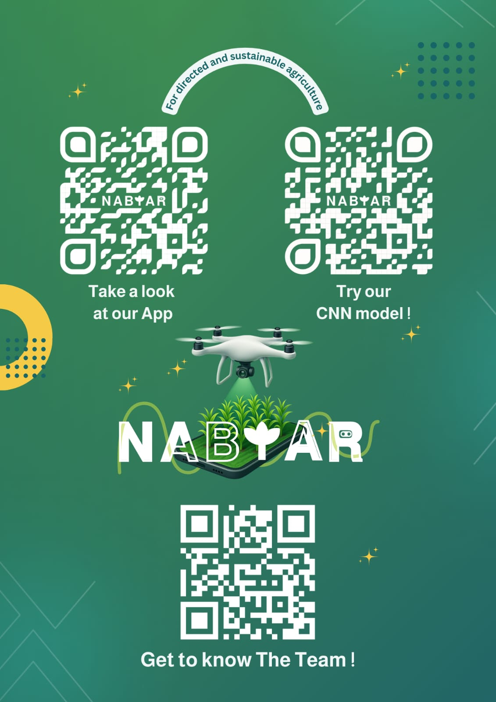

# 🌱 NABTAR - Smart Agriculture Assistant

**Nabtar** is an intelligent agriculture assistant that helps farmers and agricultural decision-makers analyze soil type, recommend suitable crops, and get weather warnings — all through a mobile app powered by AI.

---

## 📱 Features

- 🧠 **Soil Type Detection** from image using CNN model
- 🌾 **Crop Recommendation** based on soil and location
- ☁️ **Live Weather Alerts** (humidity & rainfall)
- 📍 Location-aware suggestions (e.g., Abha region)
- 🚁 Drone-based soil scanning (future extension)

---

## 🧠 AI Models Used

| Task                  | Model          | Format    |
|-----------------------|----------------|-----------|
| Soil Classification   | CNN (MobileNetV2) | TFLite |
| Crop Recommendation   | Random Forest     | Python  |
| Weather Data Integration | OpenWeatherMap API | API |

---

## 📂 Project Structure
NABTAR_APPV2/
├── android/
├── assets/
├── FinalModels/
├── lib/ # Flutter source code
├── test/
├── pubspec.yaml
└── README.md

---
## 👥 Team Members
- **[Layan Atta](https://github.com/Layan-Atta)** – Data Scientist, AI Specialist & UI/UX Designer
- **[Shaimaa Faris](https://github.com/PenTesterSH)** – Cybersecurity Specialist & Programmer  
- **[Renad Al-Amri](https://github.com/RenadData)** – Data Scientist, Programmer & Cloud Developer  
---
## 📸 QR for more details
Here's a quick way to explore NABTAR — just scan any of the QR codes below:

---
## 🏆 Achievements

🥉 3rd Place Winner at College Final Project Exhibition

👩‍💻 Built by a passionate student team from King Khalid University

## 🚀 Getting Started

This project is a starting point for a Flutter application.

A few resources to get you started if this is your first Flutter project:

- [Lab: Write your first Flutter app](https://docs.flutter.dev/get-started/codelab)
- [Cookbook: Useful Flutter samples](https://docs.flutter.dev/cookbook)

For help getting started with Flutter development, view the
[online documentation](https://docs.flutter.dev/), which offers tutorials,
samples, guidance on mobile development, and a full API reference.

## 📬 Contact
Feel free to reach out via my LinkedIn
[Layan Atta](https://www.linkedin.com/in/layan-atta)

